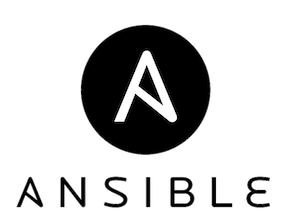

MACOS SETUP
===========
   
macos-setup is a small project based on ansible to automate software installation for fresh macos install.

Usage
-----
[install.sh](install.sh) is base script that installs main dependencies: [Homebrew](https://brew.sh/) and [Ansible](https://www.ansible.com/)   
[macos.sh](scripts/macos.sh) is a script that contains some optional system tweaks   
[ansiblefiles.sh](ansiblefiles.sh) runs all of the ansible tasks by default. It's possible to pass a single tag to run one single role. [playbook.yml](playbook.yml) contains all of the available software to install.   
### dotfiles
Dotfiles management by [GNU stow](https://www.gnu.org/software/stow/) is supported. Dotfiles location is saved in [variables config](group_vars/all/all.yml) and it assumes it contains stow.txt file with a list of dotfiles with each file/folder on line. stow role performs stowing, comment it out of [playbook.yml](playbook.yml) to not use this feature.
